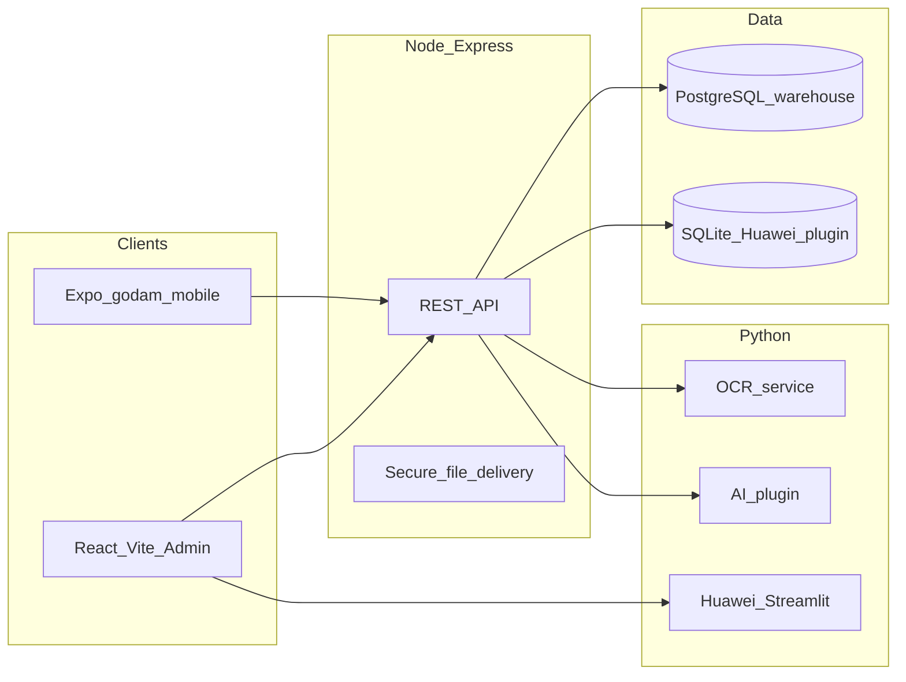

# GoDam architecture (overview)

- **Auth:** JWT in `Authorization: Bearer` (web stores token in `localStorage`; mobile uses `expo-secure-store`). Optional `jti` revocation on logout (`revoked_tokens` table).
- **Files:** No public `/uploads` static route; browser and API clients use `/api/files/uploads/*` with JWT.
- **Warehousing:** Outbound, FIFO, delivery notes, transportation, BOM, audit logs — see route map in [`backend/mountApiRoutes.js`](../backend/mountApiRoutes.js).
